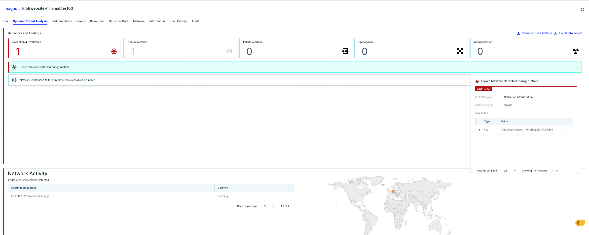

# Cloud Native Security Demo website

This website is used to showcase the projects in this GitHub organization as well as for demo projects.

It is built using React and based on the following project: [Cleanfolio Minimal](https://github.com/rajshekhar26/cleanfolio-minimal).

## Instructions

### Setup

- Install and run 

```shell
yarn
yarn start
```

- Build and deploy 

```shell
yarn build
yarn deploy
```

## Features in Container Vulnerabilities

- Vulnerability management
-	Malware detection.
-	Dynamic Analisis in Containers.
-	Applied policies integrated with CI/CD.
-	Virtual Patch in Containers.

Screenshot of the demo using DTA with the image **krol/website-minimal:test03**



More information about DTA:

- [Dynamic Threat Analysis for Container Images: Uncovering Hidden Risks
by the Aqua's cyber research team](https://blog.aquasec.com/dynamic-container-analysis)
- [Fileless Malware Executing in Containers](https://blog.aquasec.com/fileless-malware-container-security)
## Contributing

If you would like to make changes to the repository, please submit a [PR.](https://github.com/Cloud-Native-Security/website/pulls)

## License

[MIT](https://choosealicense.com/licenses/mit/)
